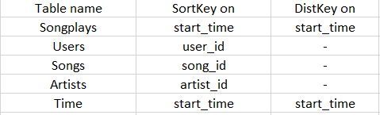

# Datawarehouse on AWS Redshift

## Introduction

A startup called Sparkify wants to analyze the data they've been collecting on songs and user activity on their new music streaming app. The analytics team is particularly interested in understanding what songs users are listening to. Currently, they don't have an easy way to query their data, which resides in a directory of JSON logs on user activity on the app, as well as a directory with JSON metadata on the songs in their app.

## Purpose

It is difficult to view and query data in JSON format. The goal is to create an ETL pipeline to read all the data files and put them into s3 staging area. Then  load data from S3 to staging tables on Redshift and execute SQL statements that create the analytics tables from these staging tables.
## Datasets

### 1. Song Dataset
This dataset is a subset of real data from the Million Song Dataset. Each file is in JSON format and contains metadata about a song and the artist of that song. The files are partitioned by the first three letters of each song's track ID. 

### 2. Log Dataset
This dataset consists of log files in JSON format generated by this event simulator based on the songs in the dataset above. These simulate activity logs from a music streaming app based on specified configurations.The log files in the dataset you'll be working with are partitioned by year and month. 

## Database Schema Design

#### Staging Tables
- staging_events
- staging_songs

####  Fact Table
- songplays - records in event data associated with song plays i.e. records with page NextSong - 
*songplay_id, start_time, user_id, level, song_id, artist_id, session_id, location, user_agent*

#### Dimension Tables
- users - users in the app - 
*user_id, first_name, last_name, gender, level*
- songs - songs in music database - 
*song_id, title, artist_id, year, duration*
- artists - artists in music database - 
*artist_id, name, location, lattitude, longitude*
- time - timestamps of records in songplays broken down into specific units - 
*start_time, hour, day, week, month, year, weekday*

Justification: Since the data is big, it's better choice to use sorting key strategy rather than distribute All strategy to distribute data on clusters.

## How to run

1. Fill the configuration file values in dwh.cfg

2. Run the *Cluster Setup.ipynb* file (till step 4) to set up the needed infrastructure for this project.

3. Run the *create_tables* script to set up staging and anlytical tables in redshift cluster.

    `$ python create_tables.py`

4. Finally, run the *etl* script to extract data from the files in S3, stage it in redshift, and finally store it in the dimensional tables.

    `$ python create_tables.py`

5. To see the data, use the query editor on newly created redshift cluster avaliable on aws.

6. If you want to delete the cluster after use, run step 5 from *Cluster Setup.ipynb* file.